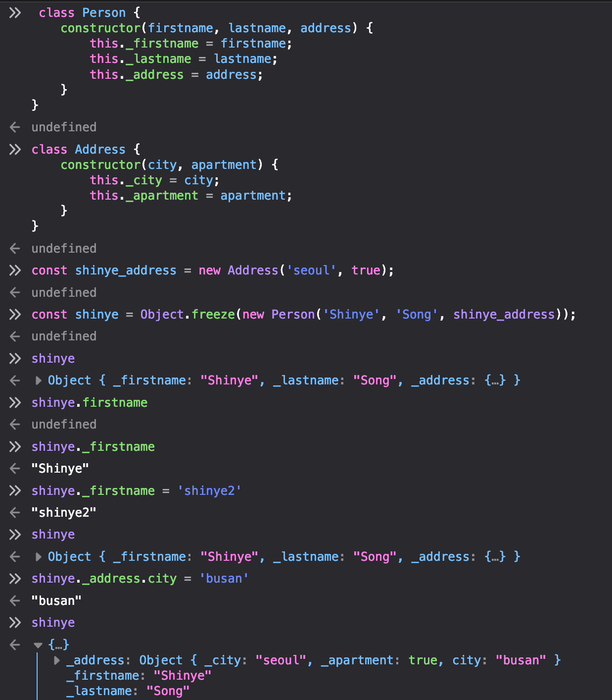

# Chapter2. 고계 자바스크립트

## 함수형과 객체지향 프로그래밍

> 객체지향은 동작하는 부분을 캡슐화해서 이해할 수 있게 하고, 함수형 프로그래밍은 동작하는 부분을 최소화해서 코드 이해를 돕는다.

객체지향과 함수형의 가장 중요한 차이점은 **상태를 관리하는 방향** 에 있다.

- 객체지향 프로그래밍은 객체 기반의 캡슐화에 의존해 **객체 안에서 상태를 관리**하여 무결성을 유지한다. 상태를 저장하는 필드와 필드를 이용한 기능을 제공하는 메소드를 붙여서 클래스를 만들고, 누가 어디까지 볼 수 있는지 접근을 제어할 수 있다. 메소드와 속성간의 관계가 단단히 유착되어 응집도 높은 패키지가 설정된다. 
- 반면 함수형 프로그래밍은 객체지향에서 지향하는 바와 같이 상태를 저장하기 보다는 상태를 없애는 데에 주력한다. 함수의 본질은 값을 입력하면 예상 가능한 값을 출력하는 것이기 때문에 상태를 저장하지 않는다. 따라서 매우 간결하게 코드 작성이 가능하고 특정 객체에만 한정적인 것이 아닌 여러 자료형에 두루 적용 가능한 연산에 집중한다.

예시)

```javascript
// 객체지향형
class Person {
    ...
    get fullname() { // 대개 this를 통해 객체에 접근
        return [this._firstname, this._lastname].join(' ');
    }
}

// 함수형
const fullname = (Person) => { // 매개변수로 전달받은 객체를 사용한다.
    return [Person.firstname, Person.lastname].join(' ');
}
```

자바스크립트는 동적 언어여서 (함수형 프로그래밍 예시의) fullname()은 Person의 모든 파생형 객체 (firstname, lastname속성을 지니고 있는 모든 객체) 에서 잘 동작한다. 다시 말에 Person을 가리키는 레퍼런스를 가진 객체에서 모두 동작한다는 것이다.

정리하자면, OOP는 메서드에 상속 계층을 두고 데이터를 서로 단단히 묶는 일에 집중한다면, 함수형 프로그래밍은 다양한 자료형을 아우르는 일반적인 다형성 함수를 선호하며 this는 **가급적 사용하지 않는다.**

|                   |                      함수형                      |               객체지향형               |
| :---------------: | :----------------------------------------------: | :------------------------------------: |
|     합성 단위     |                       함수                       |              객체(클래스)              |
| 프로그래밍 스타일 | 선언적 (실행할 일련의 함수를 선언하는 것에 집중) |    명령형 (알고리즘적 로직에 집중)     |
|   데이터와 기능   |        독립적인 순수함수가 느슨하게 결합         |   클래스 안에서 메서드와 단단히 결합   |
|     상태 관리     |             객체를 불변 값으로 취급              | 인스턴스 메서드를 통해 객체를 변이시킴 |
|     제어 흐름     |                   함수와 재귀                    |            루프와 조건 분기            |
|      캡슐화       |            모든것이 불변이라 필요없음            |    데이터 무결성을 지키기 위해 필요    |


### Object.freeze() ?

언제든 객체에 접근해 속성 값을 변경할 수 있는 자바스크립트의 특징에 따라, 선언한 객체의 수정을 막을 수 있는 메소드.<br />새로운 속성을 추가할 수 없고, 기존 속성의 값을 수정 및 삭제할 수도 없으며 프로토타입의 변경도 방지한다.

다만 동결한 해당 객체 속성의 내부 객체는 동결되지 않는다. 아래의 예시에서 Person클래스를 통해 만든 shinye라는 객체를 freeze시키니 Person클래스 내의 속성값의 수정은 일어나지 않지만, address속성 내의 객체인 Address객체의 속성은 변화한다.



### Copy on Write?

> Copy-on-write (sometimes referred to as "COW") is an optimization strategy used in computer programming. The fundamental idea is that if multiple callers ask for resources which are initially indistinguishable, you can give them pointers to the same resource. This function can be maintained until a caller tries to modify its "copy" of the resource, at which point a true private copy is created to prevent the changes becoming visible to everyone else. All of this happens transparently to the callers. The primary advantage is that if a caller never makes any modifications, no private copy need ever be created.

> Linux uses it when it uses `clone()` to implement `fork()` - the parent process's memory is COWed for the child.

정리하자면, 특정 리소스에 대한 요청에 대해 각각 해당 리소스에 대한 포인터를 제공하여 참조를 가능하게 하여 마치 해당 리소스에 대한 복사가 일어난 것 처럼 한다. 하지만 실제로 복사가 일어나는 시점은 해당 리소스에 대한 수정이 일어나는 시점에서만이다. 

[https://twitter.com/b0rk/status/987727508241092608](https://twitter.com/b0rk/status/987727508241092608) <br />[https://drawings.jvns.ca/copyonwrite/](https://drawings.jvns.ca/copyonwrite/)


## 자바스크립트에서의 함수

### 일급시민 (First-class function)

> A programming language is said to have **First-class functions** when functions in that language are treated like any other variable. For example, in such a language, a function can be passed as an argument to other functions, can be returned by another function and can be assigned as a value to a variable.

**함수가 마치 변수처럼 다뤄지는 것**을 일급시민 함수라고 부른다. <br />자바스크립트에서의 함수는 일급시민이다. 일급시민의 특징은 다음과 같다.

- 함수를 변수에 할당 가능하다. 

  ```javascript
  const foo = function() {
     console.log("foobar");
  }
  // Invoke it using the variable
  foo();
  ```

- 함수를 또다른 함수의 변수에 할당 가능하다.

  ```javascript
  function sayHello() {
     return "Hello, ";
  }
  function greeting(helloMessage, name) {
    console.log(helloMessage() + name);
  }
  // Pass `sayHello` as an argument to `greeting` function
  greeting(sayHello, "JavaScript!");
  ```

- 함수를 리턴할 수 있다.

  ```javascript
  const sayHello = function() {
     return function() {
        console.log("Hello!");
     }
  }
  sayHello()();
  // or
  const myFunc = sayHello();
  myFunc();
  ```

### 고차함수 (Higher-order function)

앞서 작성한 일급시민의 개념에 기반한 것으로, 컴퓨터 과학(Computer Science)에서 적어도 아래 중 하나 이상을 만족하면 HOF라 할 수 있다. 자바스크립트의 함수는 일급+고차함수여서 **여느 값이나 다름 없다**고 간주할 수 있다. 즉, 자신이 입력 받은 입력값을 기반으로 정의된 언젠가는 실행 될 값이라는 것이다.

- 하나 이상의 함수를 인자로 받는다.
- 함수를 결과로 반환한다.

우리가 흔히 쓰는 `.map()` , `.forEach()` 등도 고차함수를 활용한 것이다.

### .Call() / .Apply()

함수를 호출하는 방법으로는 함수 뒤에 () 를 붙이는 것과 call / apply를 실행하는 것이 있다.

```javascript
const example = function (a, b, c) {
  return a + b + c;
};
example(1, 2, 3);
example.call(null, 1, 2, 3);
example.apply(null, [1, 2, 3]);
```

`call()`  또는 `.apply()` 를 사용하면 이미 존재하는 함수를 호출할 때 다른 `this` 객체를 할당할 수 있다.

예시 내의 call과 apply가 가진 공통적인 첫 번째 인자(null) 가 하는 일은 this를 대체하는 것이다. 메소드가 [non-strict mode](https://developer.mozilla.org/ko/docs/Web/JavaScript/Reference/Strict_mode) 코드의 함수일 경우, [`null`](https://developer.mozilla.org/ko/docs/Web/JavaScript/Reference/Global_Objects/null) 과 [`undefined`](https://developer.mozilla.org/ko/docs/Web/JavaScript/Reference/Global_Objects/undefined) 가 전역 객체로 대체되며, 기본 값은 제한된다.

`.call()`과 `.apply()` 의 기능은 동일하지만, 차이점은 해당 function을 호출할 시 필요한 인자를 유사배열 형식으로 전달하느냐 아니냐다.

🥴 **그렇다면 `.bind()`  는?** 원하는 Function 에 인자로 넘긴 `this` 가 바인딩 된 새로운 함수를 리턴한다.

```javascript
this.x = 9;
var module = {
  x: 81,
  getX: function() { return this.x; }
};

module.getX(); // 81

var retrieveX = module.getX;
retrieveX();
// 9 반환 - 함수가 전역 스코프에서 호출됐음

// module과 바인딩된 'this'가 있는 새로운 함수 생성
// 전역 변수 x와 module의 속성 x를 혼동할 수 있음
var boundGetX = retrieveX.bind(module);
boundGetX(); // 81
```


### 질문

그러고보니 왜 이름을 Higher order function이라고 지었는가? 일급시민과 비슷한 맥락으로 가장 높은 우선 순위를 가진 특성을 가진 특징이라서??? (???뭔말인지..)


### Reference

[https://futurecreator.github.io/2018/10/05/why-functional-programming/](https://futurecreator.github.io/2018/10/05/why-functional-programming/)<br />[https://github.com/funfunStudy/study/wiki/%EB%AA%85%EB%A0%B9%ED%98%95-%ED%94%84%EB%A1%9C%EA%B7%B8%EB%9E%98%EB%B0%8D%EA%B3%BC-%ED%95%A8%EC%88%98%ED%98%95-%ED%94%84%EB%A1%9C%EA%B7%B8%EB%9E%98%EB%B0%8D-%EB%B9%84%EA%B5%90](https://github.com/funfunStudy/study/wiki/%EB%AA%85%EB%A0%B9%ED%98%95-%ED%94%84%EB%A1%9C%EA%B7%B8%EB%9E%98%EB%B0%8D%EA%B3%BC-%ED%95%A8%EC%88%98%ED%98%95-%ED%94%84%EB%A1%9C%EA%B7%B8%EB%9E%98%EB%B0%8D-%EB%B9%84%EA%B5%90)<br />[http://eurobeat.ivyro.net/wp/2014/08/01/object-oriented-programming-vs-functional-programming/](http://eurobeat.ivyro.net/wp/2014/08/01/object-oriented-programming-vs-functional-programming/)<br />[http://blog.weirdx.io/post/3214](http://blog.weirdx.io/post/3214)<br />[https://www.zerocho.com/category/JavaScript/post/57433645a48729787807c3fd](https://www.zerocho.com/category/JavaScript/post/57433645a48729787807c3fd)